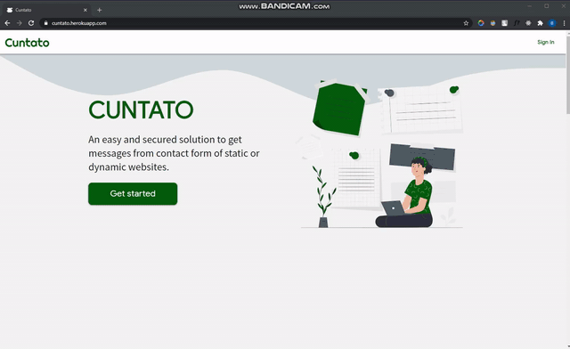

## Cuntato

An easy and secured solution to get messages from contact form of static or dynamic websites.. No need of using any **backend code**.

## Why Cuntato?

If we want to add a contact form in our website we need to write some backend code to get data. Most of people use `PHP` code to get data from the website. But there are some who don't like to use `PHP` much or don't want to get email in their email address every time a random dude type a funny messages like me :stuck_out_tongue_closed_eyes:. Sometimes it is so disturbing :weary:  
What if we have a system where we don't need to write any backend code
and get tons of irrelevant messages in our email rather we just use some `JavaScript` to get messages and save in table format through API?

## Features

- Simple authentication
- Authorization
- Ease of Setup
- Messages can be downloaded in `.pdf`, `.xlsx`, `.csv` format
- Can be copied all messages
- Eye catching design
- Responsive layout

## Technology Stack

- **Front-end**: _MaterializeCSS_, _jQuery_
- **Back-end**: _NodeJS_, _API_
- **Database**: _MongoDB_
- **Deployment**: _Heroku_
- **Version Controlling**: _Git_

## How to use?

#### Sign In

To keep things less complicated we used **Google**, **Github**, **Linked In** authentication.

#### Create Project

After successful authentication you'll be redirected to your dashboard. If you are a first time user then you'll only see a **Add Project** button. After clicking that a modal will popup where you need to give name of your project. Project name doesn't need to be a valid name but it needs to be unique. Then you'll need to add **Domain URL** of your websites `e.g. https://personal-site.github.io`. Click on the **Create project** button and you'll see your project name in a card. You can't create more than three projects.

#### Project

Click on the project name, you'll be redirected to your project page where you'll see two tab named as `Message` and `Setup` `Message` tab is where your messages will be shown in table form. Now go to `Setup` tab and you'll see prebuilt `HTML` and `jQuery` code. All you need is to copy the `jQuery` code and paste it in `script` tag of your contact form page. If you don't use prebuilt `HTML` that we provided then make sure you have exact `id`s of input field in both `HTML` and `jQuery`.

_**N.B**: If you don't like jQuery you can use `axios` or any other medium to post the data to the API_

## Project Gif

|              Gif               |              Message table               |
| :----------------------------: | :--------------------------------------: |
|  |  |

## Geeky Contributors

<table>
<tr>
<td align="center"><a href="https://zubayerhimel.github.io"> <b>Zubayer Himel</b></a> <a href="#" title="Idea & Planning">🤔</a><a href="#" title="Design">🎨</a><a href="#" title="Documentation">📖</a></td>
<td align="center"><a href="https://jinnatul.github.io"> <b>Jinnatul Islam</b></a> <a href="#" title="Backend">⚙️</a><a href="#" title="Testing">🔨</a></td>
</tr>
</table>

This project is made with :heart: and LICENSED under [MIT](LICENSE)
